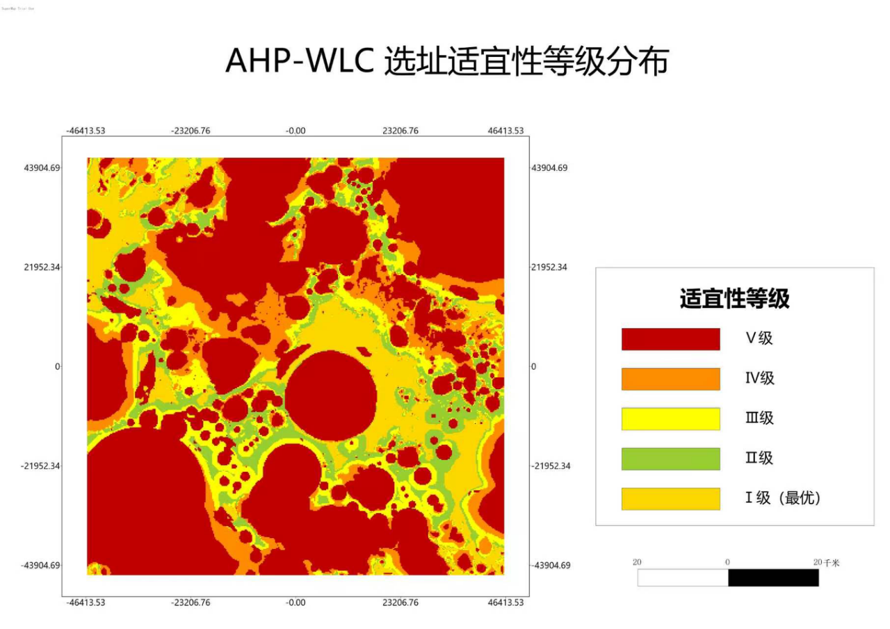
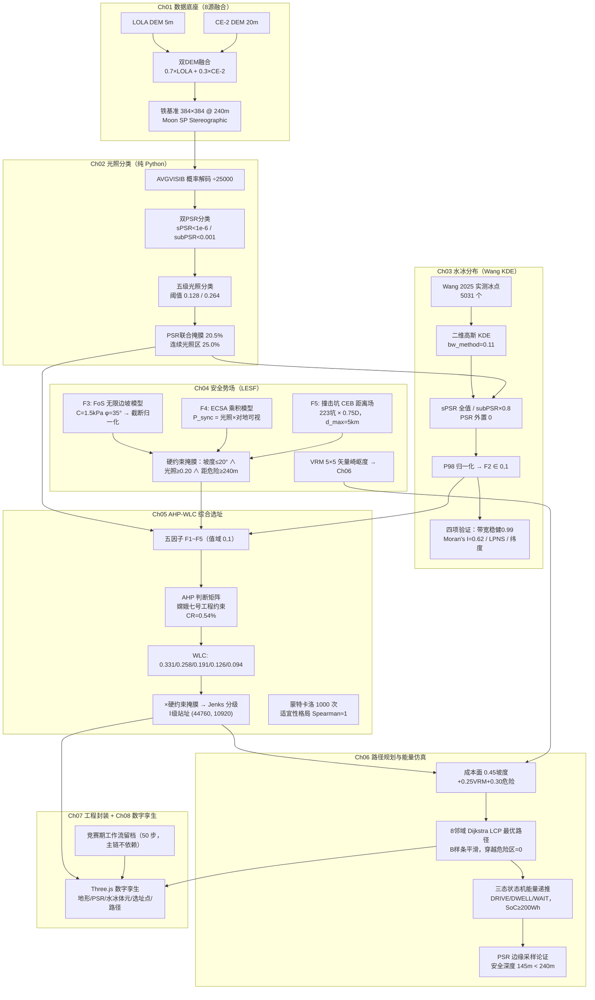
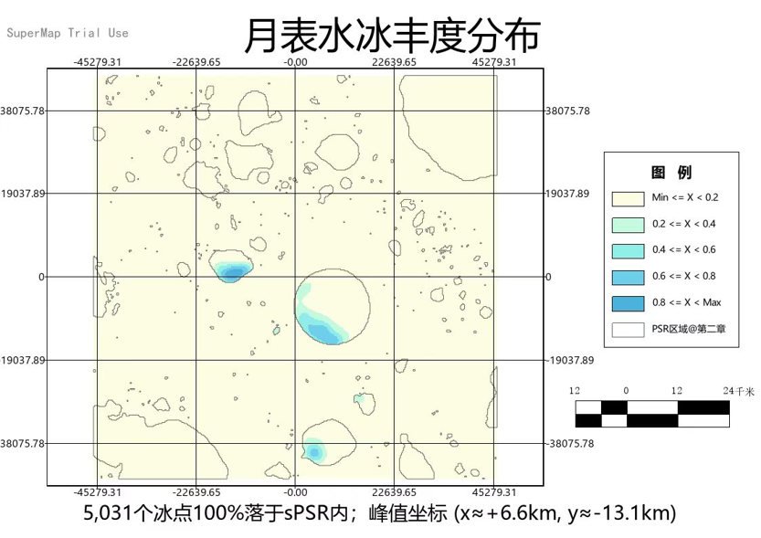
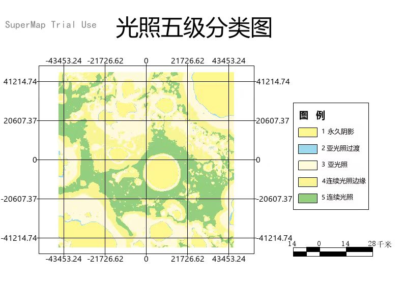
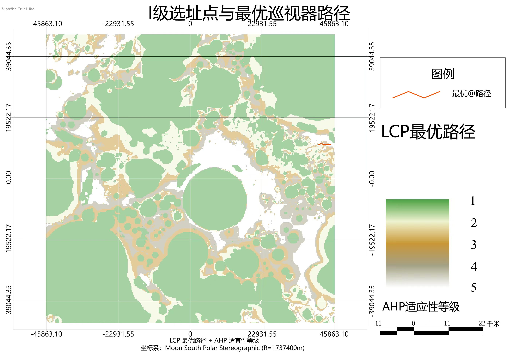
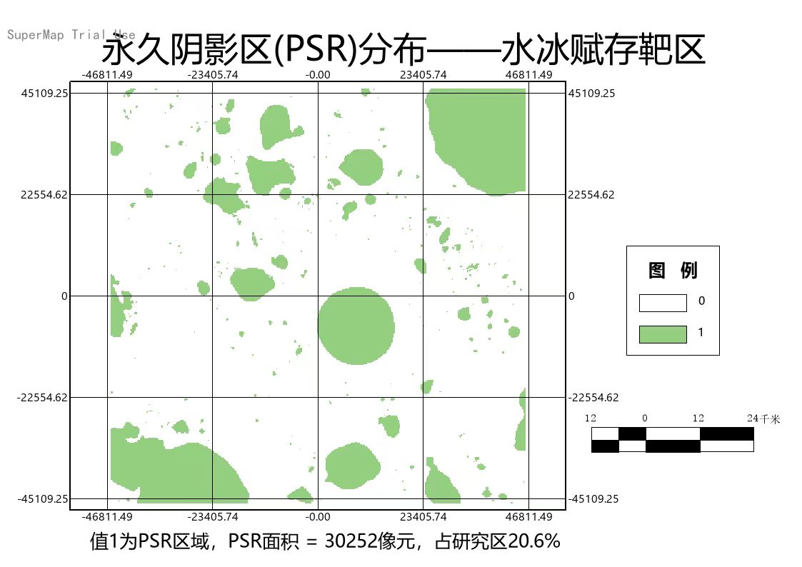

# 月球南极 Shackleton 环形山科研站选址：多准则空间决策分析与数字孪生仿真

**Lunar South Pole Shackleton Crater Research Station Site Selection: Multi-Criteria Spatial Decision Analysis & Digital Twin Simulation**

> 一句话：以 8 项月球探测原始数据为底座，构建"数据底座 → 光照分类 → 水冰分布 → 安全势场 → AHP 综合选址 → 路径规划 → GPA 自动化 → 数字孪生"的完整地外行星 GIS 选址方法链，并在浏览器里可交互探索。
>
> In one sentence: a complete planetary-GIS site-selection pipeline built on 8 raw lunar datasets — from a fused DEM foundation through illumination classification, water-ice KDE mapping, a geotechnical safety field, AHP-WLC decision making and energy-constrained path planning, to a 50-step SuperMap GPA automation model and an interactive Three.js digital twin.




**第二十四届 SuperMap 杯高校 GIS 大赛 · 分析组 · 参赛作品**
yuyi（队长 · 总体设计与全流程实现）｜ 团队成员与指导教师（详见论文正式署名）

---

## 目录

- [项目背景](#项目背景)
- [研究区与数据](#研究区与数据)
- [技术路线](#技术路线)
- [核心亮点](#核心亮点)
- [团队与贡献](#团队与贡献)
- [快速开始](#快速开始)
- [仓库结构](#仓库结构)
- [成果展示](#成果展示)
- [数字孪生场景](#数字孪生场景threejs)
- [竞赛期工作流留档](#竞赛期工程化封装留档处理自动化工作流)
- [方法论文档](#方法论文档)
- [引用](#引用)
- [致谢](#致谢)
- [License](#license)

## 项目背景

中国探月工程持续推进，嫦娥七号计划于月球南极开展水冰探测与环境综合勘察。月球南极具有两项核心工程价值：**坑缘高地可获得近连续太阳光照**（满足供电需求），**永久阴影区（PSR）温度低至 35 K 以下**（水冰稳定保存的天然冷阱）。如何在"光照充足"与"水冰可及"两个空间上相互制约的条件间寻找最优平衡点，是科研站选址的核心科学问题。

本项目构建了从"环境认知"到"资源评估"、从"安全势场"到"综合选址"、从"路径可达"到"工程封装"再到"交互展示"的完整方法论链条。

## 研究区与数据

| 项目 | 规格 |
| --- | --- |
| 研究区 | 月球南极 Shackleton 环形山周缘，88.5°S–90°S，约 92 km × 92 km（8,464 km²） |
| 统一空间基准（铁基准） | 384 × 384 像元 @ 240 m，范围 ±46,080 m |
| 坐标系 | Moon South Polar Stereographic（EPSG:104903，IAU_2000_Moon，R = 1,737,400 m） |
| 软件平台 | Python 3.10+（numpy/scipy/rasterio 开源栈，主分析链）· Three.js（数字孪生）· QGIS 3.x / 商业 GIS 平台（仅竞赛期历史口径，工作流在 gpa_model/ 留档） |

整合 8 项原始数据（LOLA DEM 5 m、CE-2 DEM 20 m、光照概率 AVGVISIB、地球可视概率、Diviner 温度/冰深、LEND 超热中子、Wang 2025 实测冰点、Robbins 撞击坑目录），来源为 NASA PDS、嫦娥二号数据门户与论文补充材料。大数据文件不入库，获取方式见 [data/README.md](data/README.md)。

### 软件平台与许可声明

本项目使用以下软件平台进行空间分析与工程验证，各平台许可归属其各自厂商：

| 平台 | 用途 | 许可说明 |
| --- | --- | --- |
| 处理自动化平台（竞赛期口径） | 栅格代数、工程化工作流封装（仅 `gpa_model/` 留档需要） | 商业 GIS 软件，不随仓库分发；主分析链不依赖 |
| **QGIS 3.x** | 数据检查、成果可视化、格式转换 | 开源免费（GPL v2） |
| **Python 3.10+** | 核心算法实现（Wang KDE、能量仿真、蒙特卡洛、ECSA 诊断等） | 开源免费（PSF） |
| **Three.js** | 浏览器端数字孪生交互场景 | 开源免费（MIT） |

**主分析链 100% 纯 Python**：水冰 KDE、三态能量仿真、蒙特卡洛敏感性分析、ECSA 诊断、坐标定标、**LCP 寻路（自实现 8 邻域 Dijkstra）与 B 样条平滑（scipy）**均实现于 `src/`，不依赖任何商业软件库，可独立运行。`gpa_model/` 目录下的 `.smwu`/`.xml` 为竞赛期工作流留档（专有格式，需相应商业平台打开，软件本体不随仓库分发）。

本仓库不包含任何商业软件的安装包、破解文件或许可文件。

## 技术路线



各环节之间通过 6 道数据质量门禁（G1–G6，铁基准 384×384@240m@±46080）串联，全部 PASSED。

## 核心亮点

1. **地外行星 GIS 选址** —— 完整方法链落在月球南极（EPSG:104903 月球南极立体投影），从原始 PDS 数据到交互式数字孪生端到端打通，而非单一要素分析。
2. **Wang KDE 水冰丰度估计（核心算法）** —— 放弃预测力不足的克里金方案（LOOCV R²=0.229），直接以 Wang et al. (2025, Icarus) 深度学习 M³ 冰识别的 **5,031 个实测冰点**做各向异性高斯核密度估计（bw_method=0.11，σ_x≈1,290 m / σ_y≈1,872 m），叠加 sPSR/subPSR 分级降权与 P98 归一化，并通过带宽稳健性、Moran's I、LPNS 氢一致性、纬度分布四项独立验证。
3. **全流程纯 Python 可复现** —— Ch01–Ch06 **全部环节**不依赖任何商业 GIS 软件：`src/utils/udbx_extract.py` 直接从 SQLite 格式数据源解放栅格（逐像元 100% 回环），LCP 为自实现 8 邻域 Dijkstra（与原产出累积面误差 ULP 级），B 样条为 scipy splprep，**Ch02 光照分类与 Ch05 AHP-WLC 成图亦已补写为纯 Python 并与存档逐像元一致（L5）**；`python examples/run_pipeline.py --all` 一键端到端（14 阶段约 20 秒）。竞赛期的处理自动化工作流（50 步）在 `gpa_model/` 作为工程化封装留档。
4. **Three.js 数字孪生（可直接浏览器打开）** —— `src/ch08_digital_twin/ThreeJS_scene/index.html` 双击即可交互浏览：融合 DEM 三维地形、PSR 覆盖、地下水分冰体元、5,214 个Ⅰ级选址点、最优巡视路径与 8 阶段飞行漫游动画。
5. **六因子→五因子 AHP-WLC 多准则决策 + 不确定性量化** —— 判断矩阵每个元素以嫦娥七号工程约束层级（生存层/任务层/保障层）为依据（CR=0.54%），WLC 加权叠加 + Jenks 分级输出站址；1,000 次 Dirichlet 蒙特卡洛验证权重稳健性，另含 FoS 25 组参数敏感性扫描与 ECSA 独立性诊断。

## 团队与贡献

本项目以团队协作完成（队长总体设计、按章节分工执行，各成员贡献以论文正式署名为准）。本开源仓库由队长 **yuyi**（GitHub: [yuyi1008688](https://github.com/yuyi1008688)）维护，负责全流程集成联调、端到端验证与本纯 Python 解耦版的发布。

> 章节分工概览：Ch02/Ch03/Ch05（光照·水冰·选址）、Ch04（安全势场）、Ch06（路径与能量）、Ch08（数字孪生）。

---

## 快速开始

详细步骤见 [docs/quickstart.md](docs/quickstart.md)。三个体验层级：

```bash
# ① 零依赖：浏览器打开数字孪生（推荐先看这个）
#    Chrome/Edge 直接打开 src/ch08_digital_twin/ThreeJS_scene/index.html

# ② Python 环境：安装依赖（全部开源栈，无商业软件）
pip install -r requirements.txt

# ③ 导出栅格数据（一次性，按 data/README.md 获取原始数据后）
python src/utils/udbx_extract.py --udbx <数据源文件路径> --out data/rasters

# ④ 一键端到端（Ch01–Ch06 全链纯 Python）
python examples/run_pipeline.py --list           # 查看阶段 DAG 与数据血缘
python examples/run_pipeline.py --all            # 端到端全跑（断点续跑，约 20 秒）
python examples/run_pipeline.py --run ch05       # 只跑某章及其依赖

# ⑤ 六级精度验证（L0–L5：数据/算子/路径/端到端/参数/全链对标）
python tests/L0_verify_extract.py && python tests/L1_verify_lcp.py
python tests/L2_verify_path_metrics.py && python tests/L3_verify_energy.py
python tests/L4_verify_params_sensitivity.py
python tests/L5_verify_ch02_ch05.py && python tests/L5_verify_endtoend.py
```

各章节脚本相互独立、无跨章节依赖；路径经环境变量配置（`LUNAR_RASTER_DIR`、`LUNAR_OUTPUT_DIR` 等，默认值为相对路径，开箱即用）。

## 仓库结构

```
Lunar-South-Pole-Site-Selection/
├── README.md                        # 本文件
├── LICENSE                          # GPL-3.0
├── requirements.txt                 # Python 依赖清单
├── docs/
│   ├── methodology.md               # 技术方法详解（九章浓缩 + 参数表）
│   ├── results.md                   # 成果展示与关键数字
│   └── quickstart.md                # 快速上手指南（三级体验）
├── src/                             # 章节代码（主分析链纯 Python）
│   ├── ch01_data_foundation/        #   山体阴影等
│   ├── ch02_illumination/           #   ★ 光照分类纯 Python（双PSR/五级/F1，L5 对标 100%）
│   ├── ch03_water_ice/              #   ★ Wang KDE 核心：冰点预处理→KDE→四项验证→成果图
│   │   └── （Wang 2025 训练代码因版权未随仓库分发，冰点数据来源见 data/README.md）
│   ├── ch04_safety/                 #   LESF 势场：FoS/ECSA诊断/VRM/危险距离场/外部启动器
│   ├── ch05_ahp_site/               #   ★ AHP-WLC 成图纯 Python（硬约束/Jenks/Ⅰ级点）+ 蒙特卡洛
│   ├── ch06_path_planning/          #   ★ 纯 Python 主链：定标→验证→Dijkstra LCP→B样条→能量
│   ├── ch08_digital_twin/           #   PyVista 渲染 + 体元平台 + Three.js 场景
│   └── utils/                       #   udbx_extract / raster_grid / iron_grid 断言 / 铁基准对齐
├── tests/                           # ★ 四级精度验证（可重复运行）
│   ├── L0_verify_extract.py         #   数据层：提取回环 100%
│   ├── L1_verify_lcp.py             #   算子层：Dijkstra vs 原产出（ULP 级一致）
│   ├── L2_verify_path_metrics.py    #   路径层：长度/绕路/穿越/剖面
│   ├── L3_verify_energy.py          #   端到端：能量仿真结论
│   ├── L5_verify_ch02_ch05.py       #   Ch02/Ch05 逐像元对标 + 端到端验收
│   └── 解耦与精度验证报告.md          #   汇总报告（数字/容差/PASS-FAIL/对比图）
├── examples/
│   └── run_pipeline.py              # 纯 Python 分析链编排（--list 查看执行顺序）
├── results/
│   ├── maps/                        # 10 张成果地图（选址/光照/水冰/路径/框架）
│   ├── charts/                      # 统计验证图（WangKDE四项/FoS热力图/蒙特卡洛/能量曲线）
│   ├── stats/                       # 统计数据（蒙特卡洛点位、敏感性面积 CSV、ECSA 报告）
│   └── decouple_verification/       # 解耦验证对比图（累积面/路径叠加/能量曲线）
├── gpa_model/                       # 竞赛期处理自动化工作流（工程化封装留档）
│   ├── GPA.smwu                     # 工作空间（696 KB）
│   ├── GPA模型.xml                  # 50 步模型（288 KB）
│   └── README.md                    # 模型结构、50 节点清单
└── data/
    └── README.md                    # 8 项原始数据的来源、下载入口与栅格导出说明
```

## 成果展示

| 成果 | 说明 |
| --- | --- |
|  | **AHP-WLC 综合适宜性**：五因子加权（CR=0.54%）+ 硬约束掩膜 + Jenks 分级，Ⅰ级最优区分布于 Shackleton 坑缘高地弧段 |
|  | **Wang KDE 水冰丰度 F2**：5,031 实测冰点核密度估计，高值区（>0.5）占 2.48%，峰值区 2 km 内聚集 551 个冰点 |
|  | **五级光照分类**：sPSR / subPSR / 光照不足 / 过渡 / 连续光照（≥0.264，占 25.0%） |
|  | **Ⅰ级选址点与最优巡视器路径**：起点 (44760, 10920) → PSR 边缘采样点 (40920, 10920)，4.039 km，危险区穿越 0 |
|  | **PSR 与水冰赋存靶区**：联合 PSR 掩膜覆盖 20.5%，实测冰点 100% 落在 sPSR 内 |

更多图件（成本面、能量曲线、FoS 敏感性热力图、蒙特卡洛分布等）见 [docs/results.md](docs/results.md)。

## 数字孪生（Three.js）

**无需安装任何环境**：用 Chrome / Edge 直接打开 `src/ch08_digital_twin/ThreeJS_scene/index.html`。

- 场景内容：融合 DEM 三维地形（高程夸张 ×3）、光照分类叠加、PSR 半透明覆盖、地下水分冰体元、5,214 个Ⅰ级选址点（按得分着色）、最优巡视路径、地球远景与星空。
- 交互：鼠标拖拽旋转、滚轮缩放；点击右上角"开始飞行漫游"观看 8 阶段动画（火箭起飞 → 飞向月球 → 入轨 → 俯瞰地形 → 发现水冰 → 选址点群 → 巡视路径 → 拉远收尾）。
- 数据：同目录 `dem.json`（384×384 高程）、`points.json`、`path.json`、`ice_voxels.json` 与 3 张纹理，全部由第 2–6 章分析成果导出，可追溯到具体章节产出。
- 本项目语境下的"数字孪生"指任务规划阶段（pre-mission）的静态多源数据融合与交互式决策仿真系统，区别于工业界实时监测反馈型数字孪生。

另提供 PyVista/PyQt5 版本（`src/ch08_digital_twin/`，离屏渲染 6 视角截图与 360° GIF、可调阈值/配色/图层的体元可视化平台）。

## 竞赛期工程化封装留档（处理自动化工作流）

`gpa_model/` 保留了竞赛期**串联 Ch1–Ch6 的完整处理自动化工作流**（50 个处理步骤），作为"数据进—模型出"工程化思路的历史版本（主分析链已纯 Python 化，不依赖此目录）：

- **GPA模型.xml / GPA.smwu** —— 专有格式工作流文件，仅作留档展示（需相应商业平台打开，软件本体不随仓库分发）；
- 14 类节点工具：栅格代数（28）、邻域统计（6）、坡度/坡向/曲率（各 2）、栅格矢量化（2）、重分类、核密度、加权总和、直线距离、耗费距离/路径、自定义 Python 工具（Ⅰ级区统计）等；
- 覆盖：五级光照分类 → PSR 掩膜 → F1 归一化 → DEM 融合与地形派生 → FoS/VRM/ECSA/距离场 → 硬约束 → WLC 加权 → Jenks 分级 → Ⅰ级区统计 → 成本面合成 → LCP 最优路径。

50 节点完整清单与逐章构建思路见 [gpa_model/README.md](gpa_model/README.md)。

## 方法论文档

- [docs/methodology.md](docs/methodology.md) —— 九章技术方法详解：数据底座、双 PSR 分类、Wang KDE、LESF 势场（FoS/ECSA/F5）、AHP-WLC、路径与能量仿真、工程封装、数字孪生，含全部关键参数表与修正记录。
- [tests/解耦与精度验证报告.md](tests/解耦与精度验证报告.md) —— 纯 Python 解耦重构的四级验证报告（L0 数据层 / L1 算子层 / L2 路径层 / L3 端到端），每项验证含数字、容差与 PASS/FAIL 结论。

## 引用

如本仓库对你的研究或学习有帮助，请引用：

```bibtex
@misc{lunar_south_pole_site_selection_2026,
  title  = {Lunar South Pole Shackleton Crater Research Station Site Selection:
            Multi-Criteria Spatial Decision Analysis and Digital Twin Simulation},
  author = {yuyi and contributors},
  year   = {2026},
  howpublished = {24th SuperMap Cup National College GIS Competition (Analysis Track)},
  note   = {\url{https://github.com/<your-username>/Lunar-South-Pole-Site-Selection}}
}
```

## 致谢

- **NASA PDS**（Planetary Data System / ODE）：LOLA DEM、AVGVISIB 光照/地球可视概率、Diviner、LEND、Robbins 撞击坑数据库；
- **嫦娥工程 / 国家航天局**：CE-2 GRAS DEM（[moon.bao.ac.cn](https://moon.bao.ac.cn/)）；
- **Wang et al. (2025, Icarus)**：深度学习 M³ 冰识别点目录及配套识别代码；
- **SuperMap**：iDesktopX 平台与地理处理自动化（GPA）建模能力；
- 第二十四届 SuperMap 杯高校 GIS 大赛组委会与评审专家。

## License

代码与文档以 [GPL-3.0](LICENSE) 协议开源：任何二次分发或衍生作品须以同一协议开源并保留署名。

Copyright (C) 2026 yuyi (GitHub: yuyi1008688) 及贡献者

成果图件仅供展示引用。原始数据版权归各数据发布机构所有，请遵循各自的使用条款（NASA PDS 数据面向公众开放）。

### 免责声明

1. **零商业软件运行依赖**：本仓库的主分析链（Ch01–Ch06）**100% 纯 Python 实现**（标准库 + numpy/scipy/rasterio 开源栈），不包含、不调用、不要求安装任何商业 GIS 软件。`gpa_model/` 目录仅存有竞赛期生成的工作流留档文件（作者自产成果，专有格式），仅作历史方法溯源展示，不属于运行路径；如需查看该留档需自行持有相应平台的合法许可。
2. **学术用途**：本项目仅供学术研究、教学与个人学习使用。若用于商业项目或实际工程决策，需自行评估数据精度、算法适用性与软件许可合规性，本项目作者不对任何使用后果承担责任。
3. **数据来源**：所有月球遥感数据来源于 NASA PDS、嫦娥工程数据门户及已发表学术论文的公开补充材料，使用时请遵循各数据发布机构的引用规范与使用条款。
4. **第三方代码**：`src/ch03_water_ice/` 目录下涉及的 Wang et al. (2025) 深度学习冰识别训练代码因版权原因未随仓库分发，仅使用其公开的冰点坐标数据成果，使用时请引用原论文。
