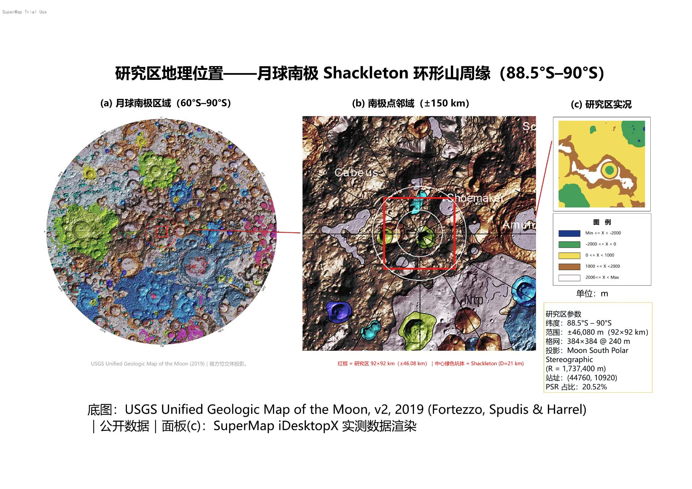
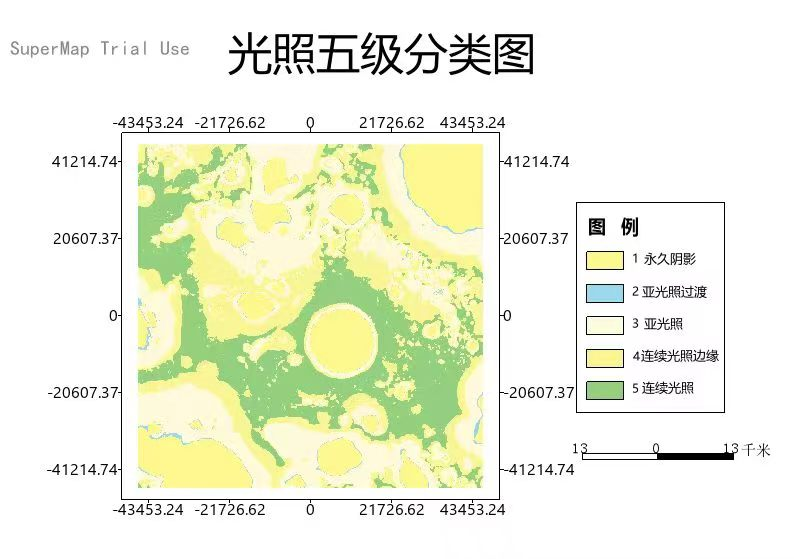
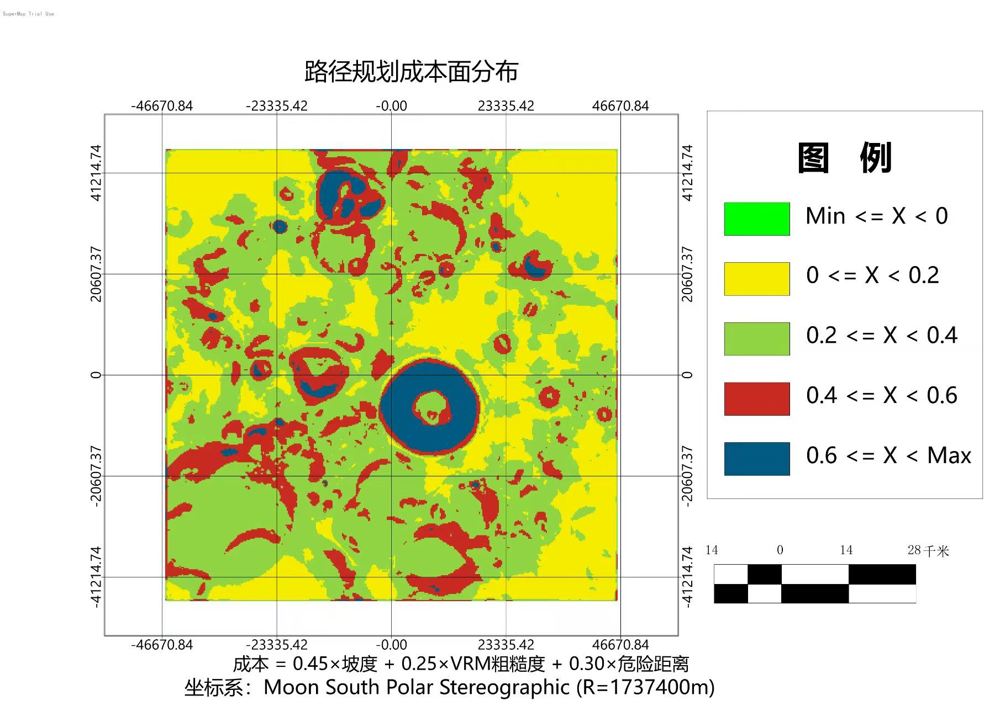
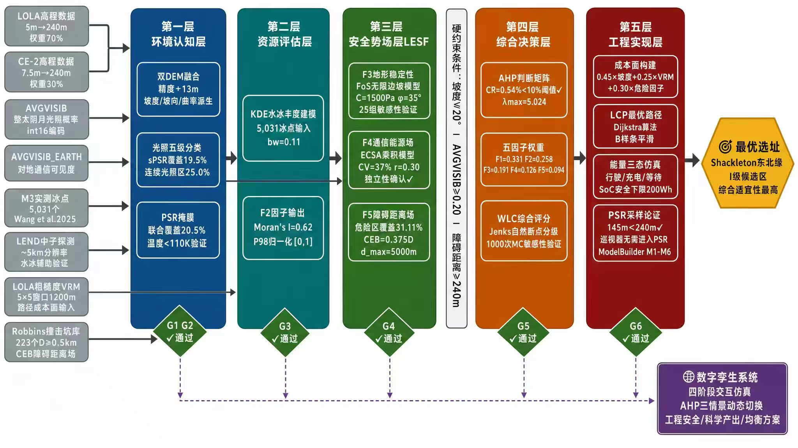
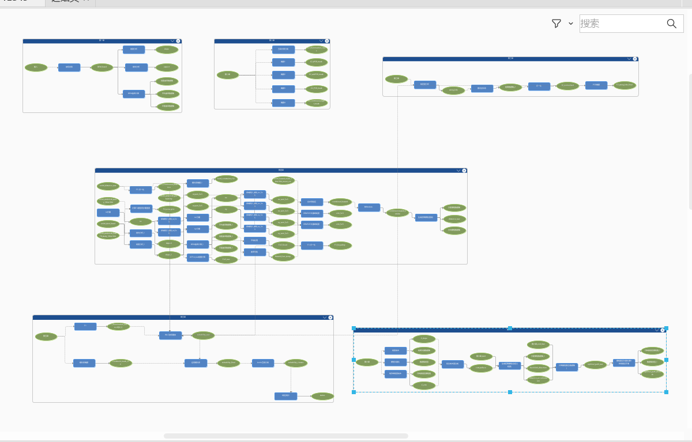

# 成果展示（Results）

> 所有图件均来自竞赛提交包 `4成果展示/` 与 `2成果数据/统计分析结果/`，数值均来自实测产出。图片可点击放大。

## 一、成果地图（results/maps/）

### 1. 研究区地理位置

月球南极 Shackleton 环形山周缘（88.5°S–90°S，92 km×92 km），月球南极立体投影（R=1,737,400 m），384×384 像元 @ 240 m。

### 2. 光照五级分类

sPSR（<1×10⁻⁶，19.5%）→ subPSR（1.0%）→ 光照不足 → 过渡 → 连续光照区（≥0.264，25.0%）。前两级保留物理阈值，后三级基于数据分布（P25=0.128 / P75=0.264）。

### 3. 光照五级分类（简化对照版）

同上，简化配色便于对照阅读。

### 4. 永久阴影区 PSR 与水冰赋存靶区

联合 PSR 掩膜（<0.001）覆盖 20.5%；实测冰点 100% 落在 sPSR 内，划定水冰赋存靶区。

### 5. 月表水冰丰度分布（Wang KDE）

5,031 个 Wang 2025 实测冰点的各向异性高斯 KDE（bw=0.11），subPSR×0.8 降权、P98 归一化。高值区（>0.5）占 2.48%，峰值区 (−14,040, +1,080) m 2 km 内聚集 551 个冰点。

### 6. 路径规划成本面

C_total = 0.45×坡度 + 0.25×VRM + 0.30×危险距离斥力场，值域 [0, 0.7895]，危险区核心强制 cost=1.0 构成物理硬防线。

### 7. AHP-WLC 选址适宜性等级分布

五因子加权（0.331/0.258/0.191/0.126/0.094，CR=0.54%）× 硬约束掩膜，Jenks 自然断点分级；Ⅰ级最优区集中于 Shackleton 坑缘高地弧段。

### 8. Ⅰ级选址点与最优巡视器路径

Ⅰ级区 5,214 个选址点；最优路径起点 (44,760, 10,920) → PSR 边缘采样点 (40,920, 10,920)，全长 4.039 km，绕路系数 1.052，危险区穿越 0。

### 9. 五层选址技术体系框架

数据底座 → 环境认知 → 资源评估 → 安全势场 → 综合决策 → 工程实现的六层方法链总览。

### 10. 选址流程 ModelBuilder（GPA）概览

SuperMap iDesktopX 处理自动化建模环境中的 50 步全流程模型（见 `gpa_model/`）。

## 二、统计验证图（results/charts/）

| 图 | 关键结论 |
| --- | --- |
| [Ch03 WangKDE 四项验证图](../results/charts/Ch03_水冰_WangKDE四项验证图.png) | 带宽稳健性（相邻带宽相关 0.99）、Moran's I=0.62 显著聚集、LPNS 氢正相关（p<0.05）、冰点密度近极点偏高 |
| [Ch03 F2 丰度验证图](../results/charts/Ch03_水冰_F2丰度验证图.png) | 冰点散点 / KDE 归一化 / PSR 掩膜后 F2 三联对照 |
| [Ch04 ECSA 诊断图](../results/charts/Ch04_安全势场_ECSA诊断图.png) | CV=82.8%≥5%、Pearson r=0.3050<0.5 → 乘积模型路径 B 成立 |
| [Ch04 FoS 敏感性热力图](../results/charts/Ch04_安全势场_FoS敏感性热力图.png) | 5×5=25 组 C×φ 参数扫描，F3>0.8 面积变化率 <20%，结论稳健 |
| [Ch04 曲率 CDF 拐点定阈](../results/charts/Ch04_安全势场_曲率CDF拐点定阈.png) | CDF 二阶导拐点法 + 高坡度区核密度双峰交叉验证确定曲率阈值 |
| [Ch05 蒙特卡洛敏感性](../results/charts/Ch05_AHP选址_蒙特卡洛敏感性.png) | 1,000 次 Dirichlet 随机权重：适宜性格局 Spearman≈0.99998，基准权重邻域扰动下站址稳定；纯随机极端权重下单点最优点会跳向单因子吸引子（详见验证报告 §L4.2） |
| [Ch05 蒙特卡洛分布（修正版）](../results/charts/monte_carlo_s8_fixed.png) | 无排序约束纯随机权重下的最优点散点、位移直方图、距离基准点分布、重叠率 |
| [Ch05 权重敏感性分析](../results/charts/sensitivity_analysis.png) | 8 组系统性扰动（±10/20/30/50%）下权重排序稳定，F1/F2 始终前两位 |
| [Ch06 能量曲线图](../results/charts/Ch06_路径规划_能量曲线图.jpg) | 三态状态机 SoC 递推：最低 215.2 Wh（红线 200 Wh 之上）、驻留充电 8 次、单程 8 个月昼 |

## 三、统计数据（results/stats/）

| 文件 | 内容 |
| --- | --- |
| `monte_carlo_points_fixed.csv` | 1,000 次蒙特卡洛最优点坐标（x, y） |
| `sensitivity_area_km2.csv` / `sensitivity_area_pct.csv` | FoS 25 组参数下 F3>0.8 面积（km² / 相对变化率%） |
| `step0_ecsa_diagnostic_report.txt` | ECSA 独立性诊断报告（CV / Pearson / Spearman 与路径判定） |

## 四、关键数字速查

| 指标 | 数值 |
| --- | --- |
| PSR 联合掩膜覆盖率 | 20.5%（sPSR 19.5% + subPSR 1.0%） |
| 连续光照区覆盖率 | 25.0%（AVGVISIB ≥ 0.264，最大光照概率 0.909） |
| 研究区内实测冰点 | 5,031 个（100% 落在 sPSR 内） |
| F2>0.5 高丰度区占比 | 2.48% |
| AHP 一致性比率 CR | 0.54%（λ_max=5.0242） |
| Ⅰ级选址点数 | 5,214 个 |
| 推荐站址坐标 | (44,760, 10,920) m |
| 实际采样点坐标 | (40,920, 10,920) m（距站址 3.84 km） |
| 最优路径 | 4.039 km，绕路系数 1.052，危险区穿越 0 |
| 能量仿真（竞赛最近邻口径） | 最低 SoC 215.2 Wh / 驻留 8 次 / 单程 8 个月昼；纯 Python 双线性剖面为 210.8 Wh / 3 次 / 5 期，最低 SoC 均 >200 Wh，工程结论一致（见验证报告 §L3） |
| PSR 安全进入深度 | 145 m（<240 m 一像元，故止步边界机械臂采样） |
| 撞击坑危险区覆盖率 | 31.11%（223 坑 × 0.75×D CEB 缓冲） |
| 蒙特卡洛适宜性格局稳健性 | Spearman≈0.99998；系统性扰动 40 组中 32 组站址原地不动（纯 Dirichlet 单点位移 σ≈43 km 属极端权重情景，非稳健性反例，见验证报告 §L4.2） |
| GPA 模型规模 | 50 节点 / 14 类工具 / 7 个 UDBX 数据源 |
